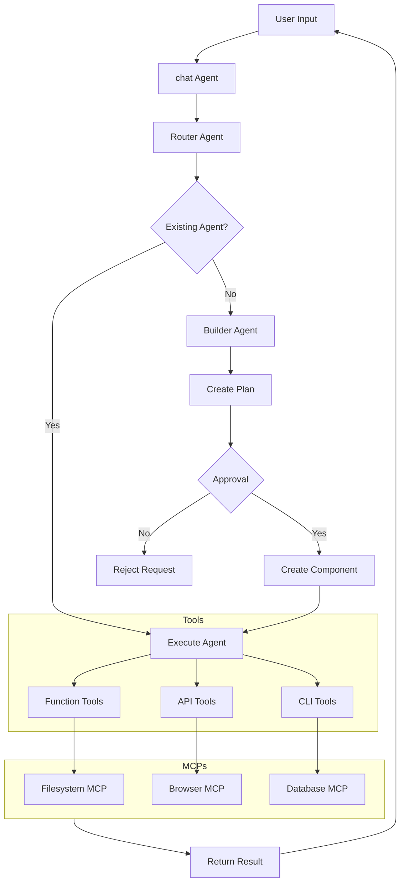

# System Architecture

## Overview

The Multi-LLM application is built with a modular, agent-based architecture that enables flexible integration of multiple language models ~~and tools~~ **tools, and Model Context Protocol (MCP) servers**. This document outlines the core architectural components and their interactions.

## Core Components

### 1. Agent System

#### Types of Agents
- **Chat Agent**: Primary user interaction interface
  - Configurable personality and behavior
  - LLM provider selection
  - Context management
  - Message history
  - **Uses MCPs for:**
    - File operations
    - Web content access
    - External services

- **Router Agent**: Request routing and delegation
  - Request analysis
  - Agent selection
  - Build request generation
  - Workflow initiation
  - **Uses MCPs for:**
    - Service health checks
    - Load balancing
    - Request routing

- **Builder Agent**: System extension
  - Component creation
  - Template management
  - Configuration validation
  - Approval workflow
  - **Uses MCPs for:**
    - Version control
    - Component generation
    - Testing

#### Agent Configuration
- LLM Provider selection
- Model parameters
- Personality traits
- Tool access
- Approval requirements
- **MCP permissions and access**

### 2. Workflow System

#### Stages
1. Initialization
2. Routing
3. Planning
4. Approval
5. Execution
6. Completion

#### Features
- Step-by-step execution
- Approval management
- State persistence
- Error handling
- Event tracking
- **MCP operation coordination**

### 3. Tool System

#### Tool Types
- **Functions**: JavaScript/TypeScript functions
  - **Can leverage MCP capabilities**
  - **MCP context integration**
- **APIs**: External service integration
  - **MCP-enhanced authentication**
  - **MCP-powered caching**
- **CLI**: Command-line tools
  - **MCP-secured execution**
  - **MCP permission checks**

#### Features
- Input validation
- Execution sandboxing
- Error handling
- Usage tracking
- Security controls
- **MCP integration**
- **MCP permission management**

### 4. Storage System

#### Components
- **ChromaDB**: Chat history and context
- **Weaviate**: Vector embeddings
- **Local Storage**: Application state
- **MCP Storage**: External capabilities

#### Features
- Data persistence
- Vector search
- State management
- Backup/recovery
- **MCP state tracking**

### 5. MCP System

#### Core MCPs
- **Filesystem MCP**: File operations
  - Read/write access
  - Search capabilities
  - Path permissions

- **Browser MCP**: Web automation
  - Page navigation
  - Content extraction
  - Form interaction

- **Database MCP**: Data storage
  - Query execution
  - Schema management
  - Connection pooling

#### Features
- Permission management
- Operation approval
- Resource limits
- Audit logging
- Error recovery

## Integration Points

### 1. LLM Integration
- LM Studio (local models)
- OpenAI API
- Claude API
- Custom providers
- **MCP-enhanced providers**

### 2. External Services
- Vector databases
- API endpoints
- CLI tools
- ~~Storage systems~~ **MCP servers**

### 3. User Interface
- React components
- Real-time updates
- Configuration management
- Workflow visualization
- **MCP operation monitoring**

## Security Architecture

### 1. Input Validation
- Request sanitization
- Parameter validation
- Type checking
- Schema enforcement
- **MCP input validation**

### 2. Execution Safety
- Command sanitization
- API request validation
- Resource limits
- Timeout controls
- **MCP operation safety**

### 3. Access Control
- Tool permissions
- Agent restrictions
- Approval workflows
- Audit logging
- **MCP access control**
- **MCP operation approval**

## Data Flow

## Best Practices

### 1. Development
- Use TypeScript for type safety
- Follow component patterns
- Implement error handling
- Write comprehensive tests
- **Document MCP usage**
- **Test MCP integration**

### 2. Security
- Validate all inputs
- Sanitize commands
- Implement rate limiting
- Regular security audits
- **Monitor MCP access**
- **Review MCP permissions**

### 3. Performance
- Optimize database queries
- Cache frequent operations
- Monitor resource usage
- Profile critical paths
- **Efficient MCP usage**
- **MCP operation batching**

### 4. Maintenance
- Regular backups
- Version control
- Documentation updates
- Dependency management
- **MCP health monitoring**
- **MCP version management**
