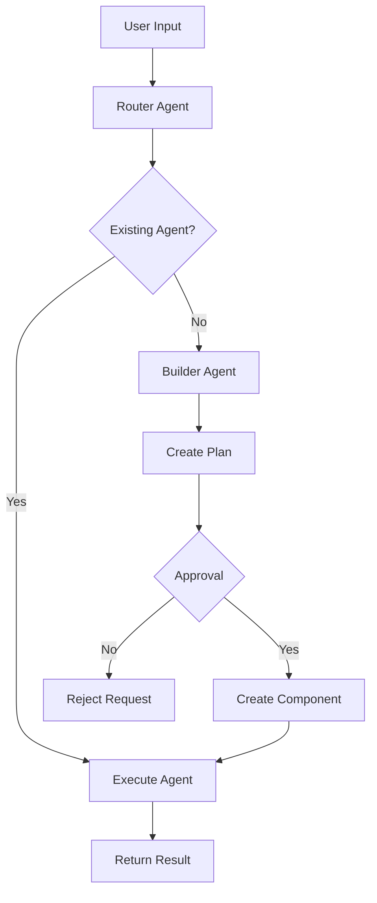

# System Architecture

## Overview

The Multi-LLM application is built with a modular, agent-based architecture that enables flexible integration of multiple language models and tools. This document outlines the core architectural components and their interactions.

## Core Components

### 1. Agent System

#### Types of Agents
- **Chat Agent**: Primary user interaction interface
  - Configurable personality and behavior
  - LLM provider selection
  - Context management
  - Message history

- **Router Agent**: Request routing and delegation
  - Request analysis
  - Agent selection
  - Build request generation
  - Workflow initiation

- **Builder Agent**: System extension
  - Component creation
  - Template management
  - Configuration validation
  - Approval workflow

#### Agent Configuration
- LLM Provider selection
- Model parameters
- Personality traits
- Tool access
- Approval requirements

### 2. Workflow System

#### Stages
1. Initialization
2. Routing
3. Planning
4. Approval
5. Execution
6. Completion

#### Features
- Step-by-step execution
- Approval management
- State persistence
- Error handling
- Event tracking

### 3. Tool System

#### Tool Types
- **Functions**: JavaScript/TypeScript functions
- **APIs**: External service integration
- **CLI**: Command-line tools

#### Features
- Input validation
- Execution sandboxing
- Error handling
- Usage tracking
- Security controls

### 4. Storage System

#### Components
- **ChromaDB**: Chat history and context
- **Weaviate**: Vector embeddings
- **Local Storage**: Application state

#### Features
- Data persistence
- Vector search
- State management
- Backup/recovery

## Integration Points

### 1. LLM Integration
- LM Studio (local models)
- OpenAI API
- Claude API
- Custom providers

### 2. External Services
- Vector databases
- API endpoints
- CLI tools
- Storage systems

### 3. User Interface
- React components
- Real-time updates
- Configuration management
- Workflow visualization

## Security Architecture

### 1. Input Validation
- Request sanitization
- Parameter validation
- Type checking
- Schema enforcement

### 2. Execution Safety
- Command sanitization
- API request validation
- Resource limits
- Timeout controls

### 3. Access Control
- Tool permissions
- Agent restrictions
- Approval workflows
- Audit logging

## Data Flow

## Best Practices

### 1. Development
- Use TypeScript for type safety
- Follow component patterns
- Implement error handling
- Write comprehensive tests

### 2. Security
- Validate all inputs
- Sanitize commands
- Implement rate limiting
- Regular security audits

### 3. Performance
- Optimize database queries
- Cache frequent operations
- Monitor resource usage
- Profile critical paths

### 4. Maintenance
- Regular backups
- Version control
- Documentation updates
- Dependency management