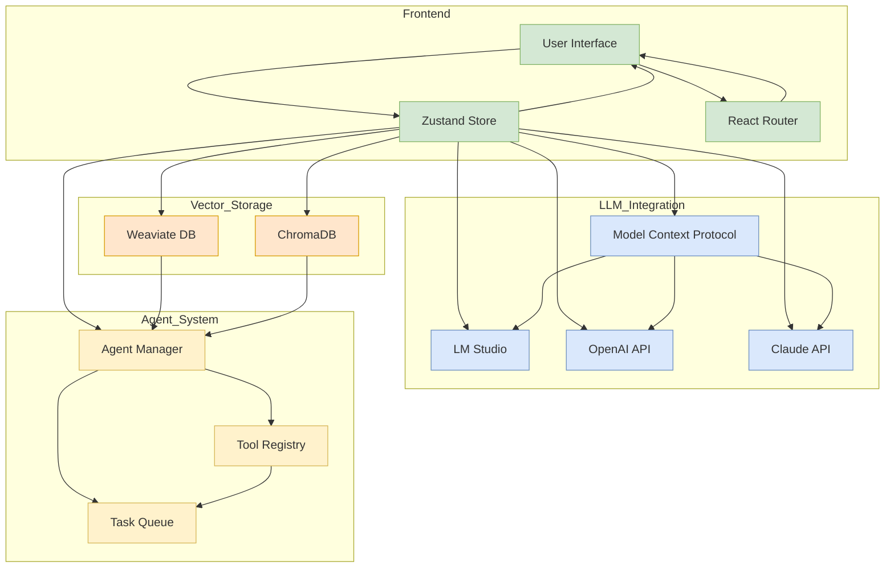

# Data Flow Architecture

```mermaid
graph TD
    subgraph Frontend
        UI[User Interface]
        Store[Zustand Store]
        Router[React Router]
    end

    subgraph LLM_Integration
        LMS[LM Studio]
        OpenAI[OpenAI API]
        Claude[Claude API]
        MCP[Model Context Protocol]
    end

    subgraph Vector_Storage
        Weaviate[Weaviate DB]
        ChromaDB[ChromaDB]
    end

    subgraph Agent_System
        Agents[Agent Manager]
        Tools[Tool Registry]
        Tasks[Task Queue]
    end

    UI --> Store
    Store --> UI
    UI --> Router
    Router --> UI

    Store --> LMS
    Store --> OpenAI
    Store --> Claude
    Store --> MCP

    MCP --> LMS
    MCP --> OpenAI
    MCP --> Claude

    Store --> Weaviate
    Store --> ChromaDB
    
    Store --> Agents
    Agents --> Tools
    Agents --> Tasks
    Tools --> Tasks

    Weaviate --> Agents
    ChromaDB --> Agents

    classDef frontend fill:#d4e8d4,stroke:#82b366
    classDef llm fill:#dae8fc,stroke:#6c8ebf
    classDef storage fill:#ffe6cc,stroke:#d79b00
    classDef agents fill:#fff2cc,stroke:#d6b656

    class UI,Store,Router frontend
    class LMS,OpenAI,Claude,MCP llm
    class Weaviate,ChromaDB storage
    class Agents,Tools,Tasks agents
```